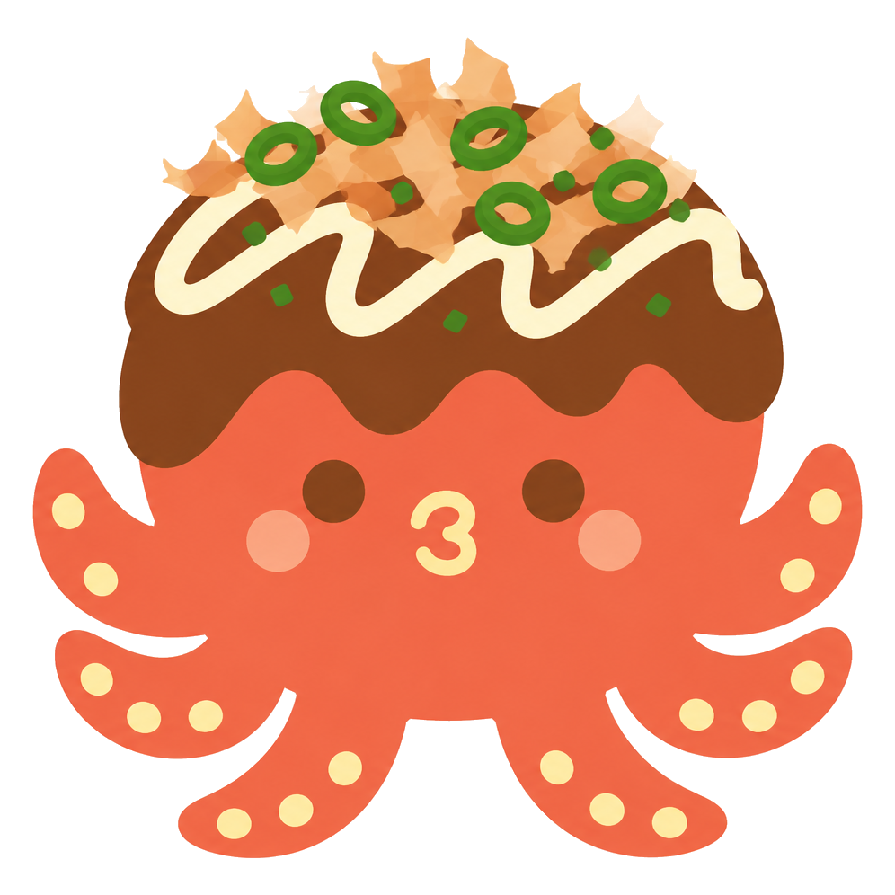

<p align="center">
  
</p>

<h2 align="center">타코야끼를 구워보자.. 지글지글.. 데굴데굴..</h2>

<p align="center">할 일을 미루면… 아직 반죽입니타코.🫠 다 익으면 완성 🐙</p>

---

## 이게 뭐임

노트북 화면 한켠에 띄워두는 미니 투두 위젯. 그날 할 일 넣고, 끝낸 건 체크하면 타코야끼가 완성!
<p align="center">
  
</p>


## 오늘의 재료

- 오늘의 todo list 🐙
- 열정 🐙
- 열정 🐙
- 열정 🐙

## 굽는 법 (실행)
서버 필요 없음, 그냥 열면 끝이타코.

```bash
git clone https://github.com/dayeoni/takoyaki-todo.git
cd takoyaki-todo
open index.html
```
<p align="center">
  
</p>

## 진짜 "위젯"처럼 데스크탑에 붙여놓기

브라우저 탭 말고 데스크탑 위에 항상 떠있는 진짜 위젯으로 쓰고 싶다면, [Übersicht](https://tracesof.net/uebersicht/)라는 무료 도구가 필요하타코🔩

```bash
brew install --cask ubersicht
```

1. Übersicht 설치 후 한 번 실행
2. **시스템 설정 → 개인정보 보호 및 보안 → 손쉬운 사용**에서 Übersicht 켜기 (안 켜면 클릭이 안 먹힌타코)
3. 이 저장소 폴더에서 로컬 서버 실행 (창 켜둔 채로 유지):
   ```bash
   python3 serve.py
   ```
4. `ubersicht-widget/index.jsx`를 Übersicht 위젯 폴더로 복사:
   ```bash
   mkdir -p ~/"Library/Application Support/Übersicht/widgets/takoyaki-todo"
   cp ubersicht-widget/index.jsx ~/"Library/Application Support/Übersicht/widgets/takoyaki-todo/"
   ```
5. Übersicht 재시작 → 화면에 타코야끼 등장 👩‍🍳

위쪽 작은 주황색 손잡이(⠿⠿)를 드래그하면 원하는 자리로 또로롱~

> ⚠️ Übersicht는 화면 전체 마우스 클릭을 붙잡는 구조라, macOS 기본 데스크탑 위젯(리마인더 등)이랑 같이 쓰면 그쪽이 안 눌릴 수 있타코. 필요할 때만 켰다 끄는 걸 추천!

## 완성됐타코
<p align="center">
  
  
  
</p>


## 재료 원산지

폰트는 [교보손글씨 2025 이유빈](https://store.kyobobook.co.kr/handwriting/font) (웹 임베딩 허용 범위 내 사용)
